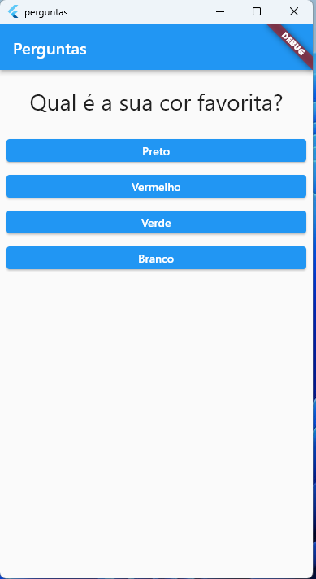
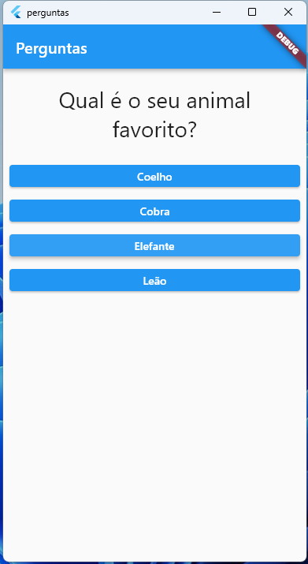
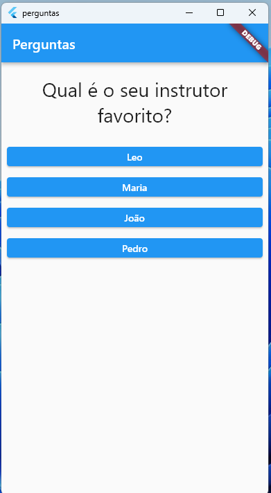
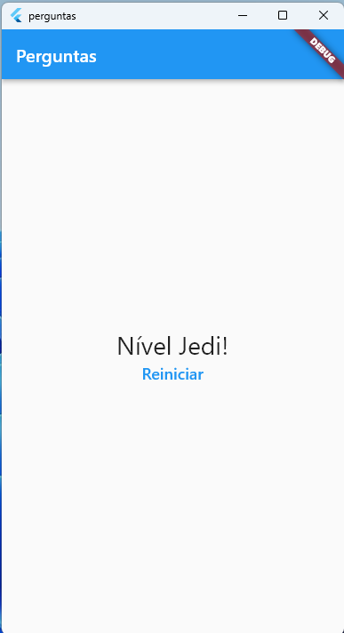

# App de  perguntas

O app dá um exemplo simples de como fazer um questionário de perguntas e repostas. 

 

## Iniciando

Para executar o projeto basta cloná-lo por meio do link a seguir:

```
git clone https://github.com/KaremSouza12/app_questions.git
```
Após fazer o clone use o comando:

```
flutter pub get
```


A few resources to get you started if this is your first Flutter project:

- [Lab: Write your first Flutter app](https://docs.flutter.dev/get-started/codelab)
- [Cookbook: Useful Flutter samples](https://docs.flutter.dev/cookbook)

For help getting started with Flutter development, view the
[online documentation](https://docs.flutter.dev/), which offers tutorials,
samples, guidance on mobile development, and a full API reference.
